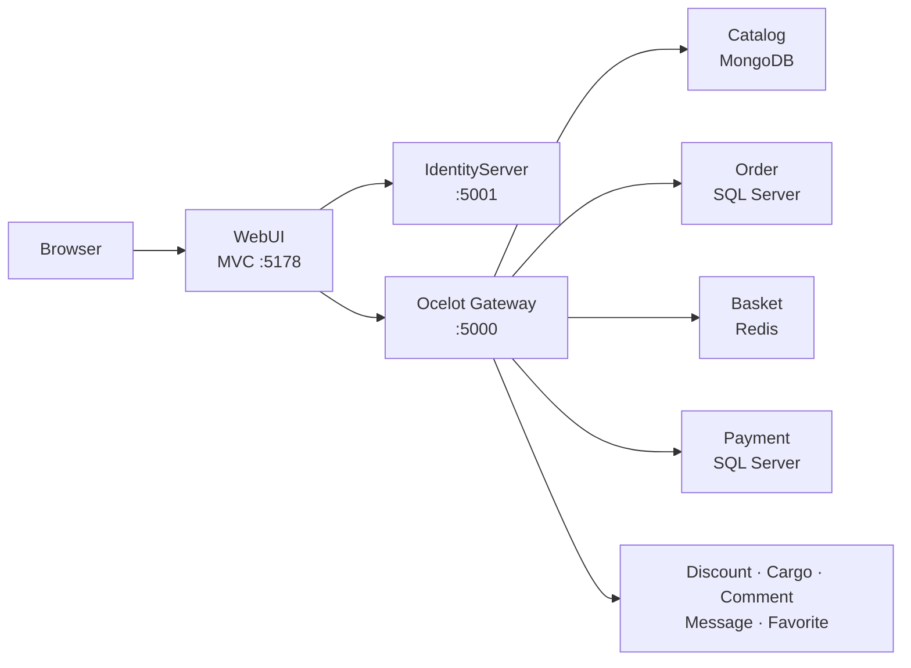

# MultiShop

[Türkçe](README.md) · **English**

**MultiShop** is a full-featured e-commerce platform built with ASP.NET Core 6 and a domain-driven microservices architecture. A single Razor MVC frontend coordinates product discovery, cart management, checkout, payment, shipment tracking, and admin workflows through independent services behind IdentityServer4 and the Ocelot API Gateway.

Each microservice runs in its own bounded context and picks the storage technology that fits its domain: SQL Server for relational flows, MongoDB for catalog data, PostgreSQL for messaging, and Redis for the live shopping cart.

---

## Table of Contents

- [Architecture Overview](#architecture-overview)
- [Technology Stack](#technology-stack)
- [Microservice Map](#microservice-map)
- [Project Structure](#project-structure)
- [Layers and Responsibilities](#layers-and-responsibilities)
- [Security Model](#security-model)
- [Business Flows](#business-flows)
- [Design Patterns](#design-patterns)
- [Setup and Running](#setup-and-running)
- [Health Check](#health-check)
- [Known Limitations](#known-limitations)

---

<a id="architecture-overview"></a>
## Architecture Overview

All requests go through a single entry point; authentication is centralized and business logic is split across service boundaries.

```
Browser
   │
   ▼
WebUI (ASP.NET Core MVC)          :5178
   │
   ├──► IdentityServer4 (OAuth2/OIDC) :5001
   │
   └──► Ocelot API Gateway           :5000
            │
            ├── Catalog      :7070  → MongoDB
            ├── Discount     :7071  → SQL Server
            ├── Order        :7072  → SQL Server
            ├── Cargo        :7073  → SQL Server
            ├── Basket       :7074  → Redis
            ├── Comment      :7075  → SQL Server
            ├── Payment      :7076  → SQL Server
            ├── Images       :7077  → (stub)
            ├── Message      :7078  → PostgreSQL
            └── Favorite     :7079  → SQL Server
```



**Why microservices?**

- Each domain (catalog, basket, order, etc.) can be deployed and scaled independently.
- Every service can use the most suitable data store.
- If one service fails, the gateway returns a controlled error instead of taking down the whole system.
- All services are protected by a shared JWT chain issued through IdentityServer.

---

<a id="technology-stack"></a>

## Technology Stack

| Layer | Technology |
|--------|-----------|
| Runtime | .NET 6 |
| Web UI | ASP.NET Core MVC, Razor, ViewComponents |
| API Gateway | Ocelot |
| Identity | IdentityServer4, ASP.NET Core Identity |
| ORM / Data access | Entity Framework Core, Dapper, MongoDB Driver, Npgsql, StackExchange.Redis |
| Databases | SQL Server, MongoDB, PostgreSQL, Redis |
| Containers | Docker (PostgreSQL, Redis) |
| API documentation | Swagger (on every microservice) |

---

<a id="microservice-map"></a>

## Microservice Map

| Service | Port | Data Store | Responsibility |
|--------|------|-------------|----------------|
| **IdentityServer** | 5001 | `MultiShopIdentityDb` (SQL Server) | Registration, login, tokens, roles |
| **Ocelot Gateway** | 5000 | — | Single entry point, routing, scope validation |
| **Catalog** | 7070 | `MultiShopCatalogDb` (MongoDB) | Categories, products, brands, sliders, contact form |
| **Discount** | 7071 | `MultiShopDiscountDb` (SQL Server) | Coupons and cart discount calculation |
| **Order** | 7072 | `MultiShopOrderDb` (SQL Server) | Addresses and order records |
| **Cargo** | 7073 | `MultiShopCargoDb` (SQL Server) | Carriers, shipment details, operation steps |
| **Basket** | 7074 | Redis (key-value) | Per-user live cart |
| **Comment** | 7075 | `MultiShopCommentDb` (SQL Server) | Product reviews and ratings |
| **Payment** | 7076 | `MultiShopPaymentDb` (SQL Server) | Payment records (masked card data) |
| **Images** | 7077 | — | Image service (stub) |
| **Message** | 7078 | `MultiShopMessageDb` (PostgreSQL) | User messages, inbox/outbox |
| **Favorite** | 7079 | `MultiShopFavoriteDb` (SQL Server) | Favorite product lists |
| **WebUI** | 5178 | — | Customer site + admin panel |

### Why these data stores?

| Technology | Used for | Rationale |
|-----------|----------|-----------|
| **SQL Server** | Identity, Order, Cargo, Comment, Discount, Favorite, Payment | Relational flows that need ACID guarantees |
| **MongoDB** | Catalog | Flexible schema and embedded documents (product images, attributes) |
| **PostgreSQL** | Message | EF Core + Npgsql, `timestamptz` support |
| **Redis** | Basket | High read/write throughput; ephemeral per-user cart data |

---

<a id="project-structure"></a>

## Project Structure

Source code lives under `MultiShop-master/MultiShop-master/`.

```
multishop_microservice/
├── README.md                          ← Turkish
├── README.en.md                       ← English (this file)
├── docs/screenshots/                  ← README screenshots
├── Start-MultiShop-Launcher.bat       ← One-click launcher (repo root)
└── MultiShop-master/MultiShop-master/
    ├── MultiShop.sln
    ├── Run-MultiShopLocal.ps1         ← Automation: check / migrate / run / all
    ├── Start-MultiShop.bat
    ├── ApiGateway/
    │   └── MultiShop.OcelotGateway/     Ocelot routes + JWT validation
    ├── IdentityServer/
    │   └── MultiShop.IdentityServer/  OpenID Connect, users and roles
    ├── Frontends/
    │   ├── MultiShop.WebUI/           MVC UI (public + Admin + User areas)
    │   └── MultiShop.DtoLayer/        Cross-layer DTOs
    └── Services/
        ├── Catalog/                     MongoDB catalog API
        ├── Discount/                    Dapper + SQL Server
        ├── Order/                       Clean Architecture (Domain → Application → Persistence → WebApi)
        ├── Cargo/                       Entity → Business → DataAccess → WebApi
        ├── Basket/                      Redis cart API
        ├── Comment/                     SQL Server review API
        ├── Payment/                     Payment record API
        ├── Images/                      Stub service
        ├── Message/                     PostgreSQL messaging API
        ├── Favorite/                    SQL Server favorites API
        └── SignalRRealTime/             Optional real-time notifications
```

---

<a id="layers-and-responsibilities"></a>

## Layers and Responsibilities

### WebUI (Presentation layer)

`Frontends/MultiShop.WebUI` is a single Razor MVC app with three surfaces:

| Surface | Location | Description |
|-----|-------|----------|
| **Public site** | `Controllers/`, `Views/` | Home, product list/detail, cart, checkout, payment |
| **Admin panel** | `Areas/Admin/` | Products, categories, brands, sliders, reviews, statistics |
| **User panel** | `Areas/User/` | My orders, shipment tracking, favorites |

**Customer UI** — color, size, price, and stock filters on the product list; add-to-cart feedback:


**Product detail** — brand, stock, quantity selector, and review rating:


**Admin panel** — product, category, brand, and statistics management (`Areas/Admin/`).

**User panel** — order history and shipment tracking (barcode, carrier, status steps):


WebUI never calls microservice ports directly. All backend traffic goes through the Ocelot Gateway via `HttpClient` and `DelegatingHandler`. Token handling is split across two handlers:

- **`ResourceOwnerPasswordTokenHandler`** — User session token (cart, order, payment)
- **`ClientCredentialTokenHandler`** — Anonymous/visitor token for service-to-service catalog reads

### API Gateway (Ocelot)

`ApiGateway/MultiShop.OcelotGateway/Ocelot.json` defines upstream/downstream routes.

- **Upstream** (public): `/services/catalog/categories`
- **Downstream** (internal): `localhost:7070/api/categories`
- Each route enforces JWT scopes through `AllowedScopes`.

### IdentityServer

Central identity service based on IdentityServer4:

- **ApiResources / ApiScopes** — Per-service permissions (`CatalogFullPermission`, `BasketFullPermission`, etc.)
- **Clients** — WebUI (`MultiShopManagerId`, ROPC), visitor (`MultiShopVisitorClient`, client credentials)
- **Roles** — `Admin`, `Customer`; seed creates an `admin` user automatically
- **Newsletter** — `AspNetUsers.IsSubscribed` flag for newsletter opt-in

### Microservice internals

**Order service** — Clean Architecture example:

```
MultiShop.Order.Domain          → Entities, domain rules
MultiShop.Order.Application     → CQRS handlers, IRepository<T>
MultiShop.Order.Persistence     → EF Core DbContext, repository implementations
MultiShop.Order.WebApi          → REST controllers
```

The Order Web API exposes address and order-detail endpoints through Swagger:


**Cargo service** — Classic layered architecture:

```
EntityLayer → BusinessLayer → DataAccessLayer → DtoLayer → WebApi
```

**Catalog service** — Single project, MongoDB driver:

- `ProductDocumentNormalizationHostedService` — Normalizes legacy document fields on startup (`brandId` → `BrandId`, `colorCode` → `ColorCode`)
- Case-insensitive color/size filtering; `BsonRepresentation(Decimal128)` for consistent price types

**Discount service** — Lightweight SQL access via Dapper (alternative to EF Core)

**Basket service** — JSON-serialized cart in Redis via `StringGet`/`StringSet`; user `sub` claim is the key

---

<a id="security-model"></a>

## Security Model

```
User login
    │
    ▼
/connect/token (ROPC)  →  access_token + refresh_token
    │
    ▼
Cookie (MultiShopJwt) + ClaimsPrincipal
    │
    ▼
HttpClient → Authorization: Bearer <token>
    │
    ▼
Ocelot Gateway → JWT validation + AllowedScopes check
    │
    ▼
Microservice API
```

| Mechanism | Implementation |
|-----------|----------|
| Authentication | IdentityServer4 OAuth2 / OpenID Connect |
| Session | HttpOnly cookie + JWT Bearer downstream |
| Authorization | Ocelot route scopes, `[Authorize]` attribute |
| Admin access | `User.IsInRole("Admin")` + `/Admin` middleware (403) |
| CSRF | `[ValidateAntiForgeryToken]` on POST forms |
| Payment safety | Full card number is never stored; only last 4 digits (`CardLast4`) |

---

<a id="business-flows"></a>

## Business Flows

### End-to-end shopping flow

```
Browse → Add to cart → Apply coupon → Address + carrier → Payment → Track shipment
```

| Step | UI | Backend | Data change |
|------|-----|---------|---------------|
| Register / Login | `/Register`, `/Login` | IdentityServer | `AspNetUsers` (SQL) |
| Product browse / filter | `/ProductList` | Gateway → Catalog | MongoDB read |
| Add to cart | `ShoppingCart/AddBasketItem` | Gateway → Basket | Redis key write |
| Coupon | Cart page | Gateway → Discount | `Coupons` read + calculation |
| Order address | `/Order` | Gateway → Order | `Addresses` (SQL) |
| Payment | `/Payment` | Gateway → Payment + Order + Cargo | `PaymentRecords`, stock decrement, `CargoDetail` + `CargoOperation` |
| Shipment tracking | `/User/Cargo` | Gateway → Cargo | Operation timeline |

The order address screen collects delivery details, carrier selection, and the order summary in one place:


### Post-payment automation

After a successful payment, `PaymentController` runs these steps in order:

1. Re-validates cart stock (`ValidateBasketStockAsync`)
2. Creates the order and order details
3. Decrements product stock (`Stock = max(0, Stock - Quantity)`)
4. Writes the payment record (masked card)
5. Creates `CargoDetail` and the first `CargoOperation`
6. Clears the cart

### Admin flow

When an admin user (`admin` / `Admin1234!`) signs in, an **Admin Panel** button appears in the header. The panel at `/Admin/Statistic/Index` provides access to categories, products, brands, sliders, reviews, carriers, and user management.


---

<a id="design-patterns"></a>

## Design Patterns

Main patterns used in the project:

| Pattern | Location | Purpose |
|-------|-------|------|
| **Dependency Injection** | All `Program.cs` files | Loose coupling, testability |
| **Repository** | `Order/Application/IRepository<T>` | Separate data access from business rules |
| **CQRS** | `Order/Application/Features/CQRS/Handlers` | Split read and write responsibilities |
| **Mediator-like handlers** | `Order/Application/Features/Mediator/Handlers` | Keep controllers thin |
| **API Gateway** | Ocelot | Single entry point, centralized auth |
| **DTO** | `MultiShop.DtoLayer` | Cross-layer data contracts |
| **Options Pattern** | `IOptions<DatabaseSettings>`, `IOptions<RedisSettings>` | Strongly-typed configuration |
| **Hosted Service** | `ProductDocumentNormalizationHostedService` | Background data normalization |
| **Delegating Handler** | `ResourceOwnerPasswordTokenHandler` | Automatic token injection in HTTP pipeline |
| **ViewComponent** | `ViewComponents/` | Composable UI parts |
| **Dapper (Micro ORM)** | Discount service | Lightweight SQL access |

---

<a id="setup-and-running"></a>

## Setup and Running

### Prerequisites

| Component | Requirement |
|---------|------------|
| .NET SDK | 6.x |
| SQL Server | `.\SQLEXPRESS` (or instance configured in appsettings) |
| MongoDB | `localhost:27017` |
| Docker Desktop | For PostgreSQL and Redis containers |
| dotnet-ef | 6.x (`dotnet tool install --global dotnet-ef`) |

### Docker containers

PostgreSQL and Redis run in Docker:

| Container | Port | Credentials |
|-----------|------|------------------|
| `multishop-postgres` | 5432 | `postgres` / `1234`, DB: `MultiShopMessageDb` |
| `multishop-redis` | 6379 | No password (local development) |

### Quick start

**One click (from repo root):**

```bat
Start-MultiShop-Launcher.bat
```

**Full control with PowerShell:**

```powershell
cd MultiShop-master\MultiShop-master

# Infrastructure check + migrations + start services
powershell -ExecutionPolicy Bypass -File .\Run-MultiShopLocal.ps1 -Mode all

# Health check only
powershell -ExecutionPolicy Bypass -File .\Run-MultiShopLocal.ps1 -Mode check -SkipBuild

# Migrations only
powershell -ExecutionPolicy Bypass -File .\Run-MultiShopLocal.ps1 -Mode migrate
```

Script modes: `check` · `migrate` · `run` · `all`

### Access URLs

| Interface | URL |
|--------|-----|
| Customer site | http://localhost:5178 |
| API Gateway | http://localhost:5000 |
| IdentityServer | http://localhost:5001 |
| Catalog Swagger | http://localhost:7070/swagger |
| Other service Swagger | `http://localhost:707x/swagger` |

> Local development runs in HTTP mode. TLS/HTTPS is required in production.

---

<a id="health-check"></a>

## Health Check

`Run-MultiShopLocal.ps1 -Mode check` verifies:

1. **Infrastructure ports** — SQL Server, MongoDB, PostgreSQL, Redis
2. **Critical URL smoke tests** — WebUI, Identity, all Swagger endpoints
3. **Ocelot route smoke tests** — 9 gateway routes with a token (catalog, discount, order, cargo, basket, message, comment, payment, images)

Manual verification examples:

```powershell
# Redis
docker exec multishop-redis redis-cli PING          # PONG
docker exec multishop-redis redis-cli DBSIZE        # > 0 after cart actions

# SQL Server
sqlcmd -S .\SQLEXPRESS -Q "USE MultiShopIdentityDb; SELECT COUNT(*) FROM AspNetUsers;"
```

---

<a id="known-limitations"></a>

## Known Limitations

This project is a **reference application** demonstrating microservices and a multi-database strategy. The following areas are intentionally simplified:

| Area | Status |
|------|-------|
| Payment | No real bank/PSP integration; simulated flow and records |
| Shipping | No external carrier API; SQL-based tracking |
| Images service | Stub; static assets under `wwwroot/images/` |
| SignalRRealTime | Optional; ready for live notification scenarios |
| HTTPS | Disabled locally; must be enabled in production |
| Rate limiting / tracing | Ocelot and Serilog/OpenTelemetry not configured |

Recommended before production: TLS certificates, distributed tracing, health check endpoints, Redis encryption/ACL, container volume strategy.

---

## License

This project was built as a personal portfolio and reference implementation.
