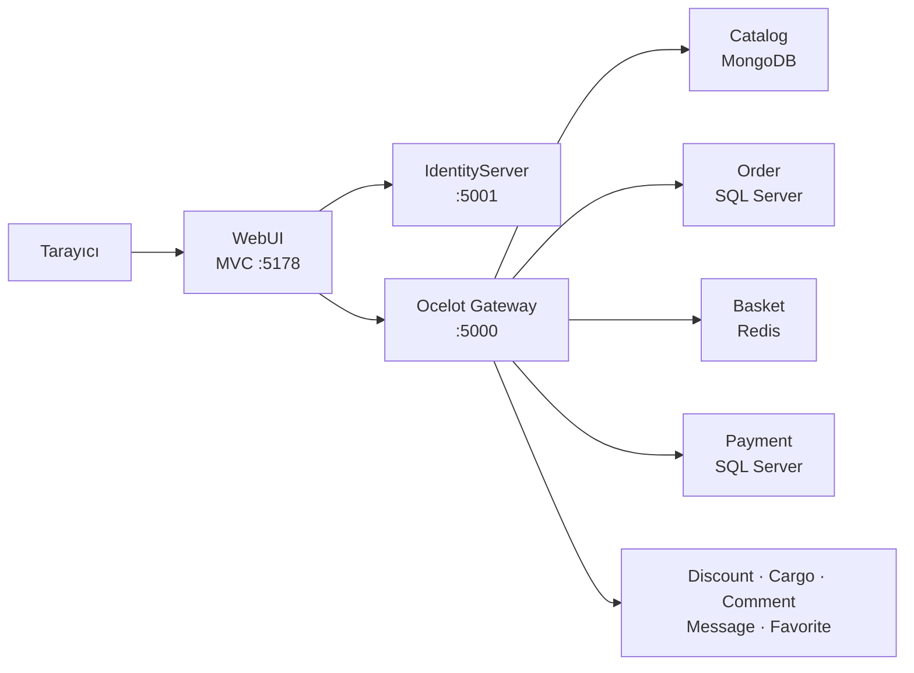
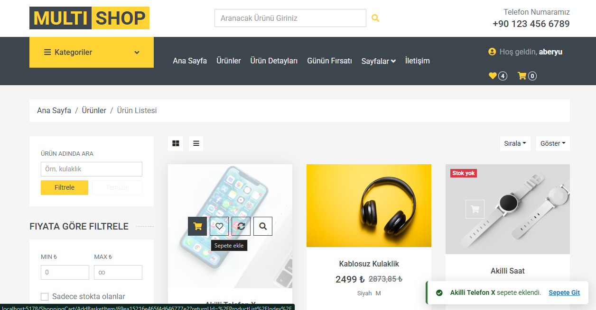
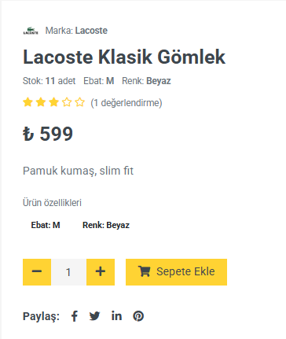
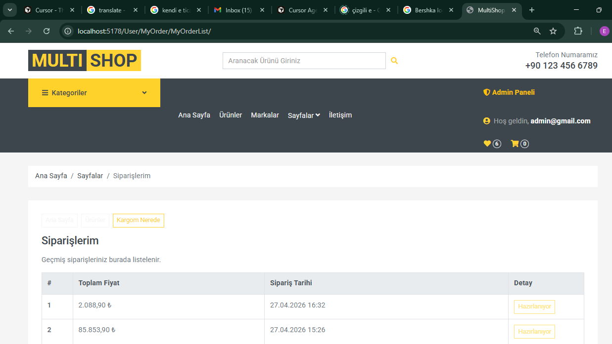
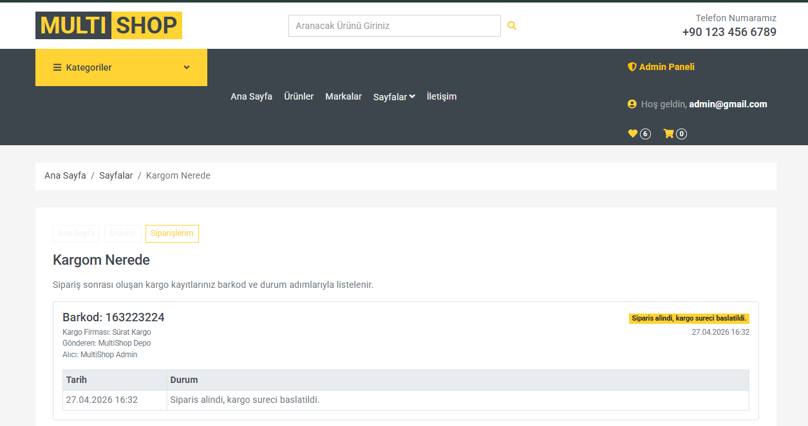
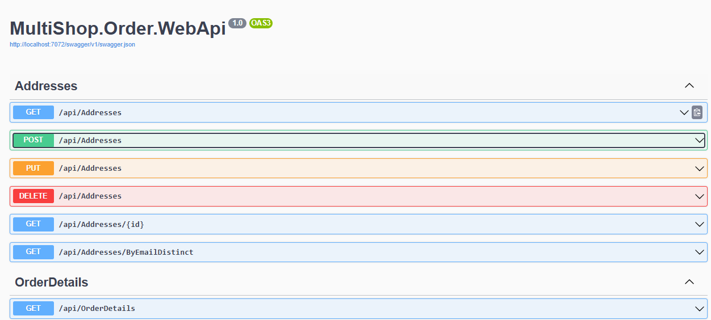
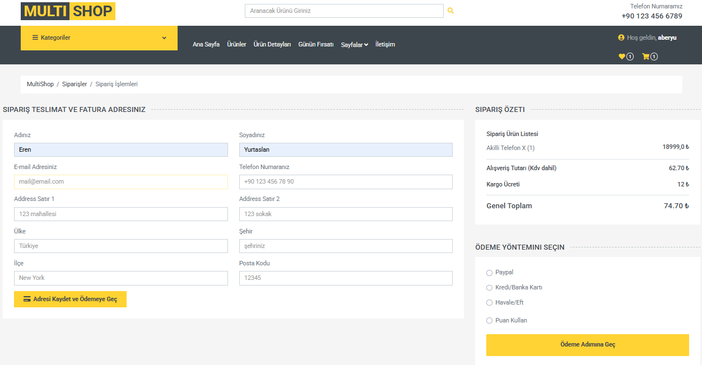
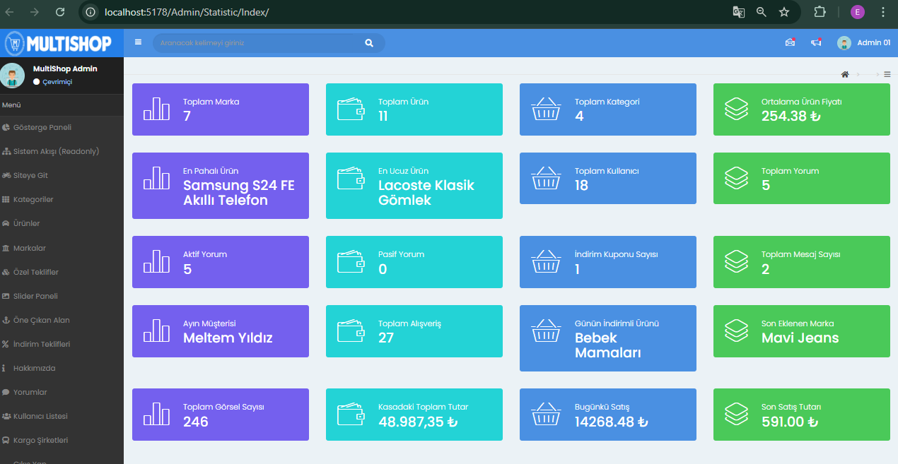

# MultiShop

**MultiShop**, ASP.NET Core 6 ile geliştirilmiş, domain odaklı mikroservis mimarisine sahip tam kapsamlı bir e-ticaret platformudur. Tek bir Razor MVC arayüzü üzerinden ürün keşfi, sepet yönetimi, sipariş, ödeme, kargo takibi ve yönetim paneli akışlarını; IdentityServer4 + Ocelot API Gateway üzerinden koordine eden bağımsız servisler sunar.

Her mikroservis kendi bounded context'inde çalışır ve ihtiyacına göre farklı veri depolama teknolojisi seçer: ilişkisel işlemler için SQL Server, katalog için MongoDB, mesajlaşma için PostgreSQL, anlık sepet için Redis.

---

## İçindekiler

- [Mimari Genel Bakış](#mimari-genel-bakis)
- [Teknoloji Yığını](#teknoloji-yigini)
- [Mikroservis Haritası](#mikroservis-haritasi)
- [Proje Yapısı](#proje-yapisi)
- [Katmanlar ve Sorumluluklar](#katmanlar-ve-sorumluluklar)
- [Güvenlik Modeli](#guvenlik-modeli)
- [İş Akışları](#is-akislari)
- [Tasarım Desenleri](#tasarim-desenleri)
- [Kurulum ve Çalıştırma](#kurulum-ve-calistirma)
- [Sağlık Kontrolü](#saglik-kontrolu)
- [Bilinen Sınırlar](#bilinen-sinirlar)

---

<a id="mimari-genel-bakis"></a>
## Mimari Genel Bakış

İstek akışı tek bir giriş noktasından geçer; kimlik doğrulama merkezi, iş mantığı servis sınırlarına dağıtılmıştır.

```
Tarayıcı
   │
   ▼
WebUI (ASP.NET Core MVC)          :5178
   │
   ├──► IdentityServer4 (OAuth2/OIDC) :5001
   │
   └──► Ocelot API Gateway           :5000
            │
            ├── Catalog      :7070  → MongoDB
            ├── Discount     :7071  → SQL Server
            ├── Order        :7072  → SQL Server
            ├── Cargo        :7073  → SQL Server
            ├── Basket       :7074  → Redis
            ├── Comment      :7075  → SQL Server
            ├── Payment      :7076  → SQL Server
            ├── Images       :7077  → (stub)
            ├── Message      :7078  → PostgreSQL
            └── Favorite     :7079  → SQL Server
```



**Neden mikroservis?**

- Her domain (katalog, sepet, sipariş vb.) bağımsız deploy ve ölçeklenebilir.
- Servis başına en uygun veri deposu seçilebilir.
- Bir servis düşse bile gateway kontrollü hata döner; monolitik çöküş riski azalır.
- Tüm servisler IdentityServer üzerinden paylaşılan JWT zinciriyle korunur.

---

<a id="teknoloji-yigini"></a>

## Teknoloji Yığını

| Katman | Teknoloji |
|--------|-----------|
| Runtime | .NET 6 |
| Web arayüzü | ASP.NET Core MVC, Razor, ViewComponents |
| API Gateway | Ocelot |
| Kimlik | IdentityServer4, ASP.NET Core Identity |
| ORM / Veri erişimi | Entity Framework Core, Dapper, MongoDB Driver, Npgsql, StackExchange.Redis |
| Veritabanları | SQL Server, MongoDB, PostgreSQL, Redis |
| Konteyner | Docker (PostgreSQL, Redis) |
| API dokümantasyonu | Swagger (her mikroserviste) |

---

<a id="mikroservis-haritasi"></a>

## Mikroservis Haritası

| Servis | Port | Veri Deposu | Sorumluluk |
|--------|------|-------------|------------|
| **IdentityServer** | 5001 | `MultiShopIdentityDb` (SQL Server) | Kayıt, giriş, token üretimi, rol yönetimi |
| **Ocelot Gateway** | 5000 | — | Tek giriş noktası, route yönlendirme, scope doğrulama |
| **Catalog** | 7070 | `MultiShopCatalogDb` (MongoDB) | Kategori, ürün, marka, slider, banner, iletişim formu |
| **Discount** | 7071 | `MultiShopDiscountDb` (SQL Server) | Kupon oluşturma ve sepet indirimi hesaplama |
| **Order** | 7072 | `MultiShopOrderDb` (SQL Server) | Adres ve sipariş kayıtları |
| **Cargo** | 7073 | `MultiShopCargoDb` (SQL Server) | Kargo firmaları, sevkiyat detayı, operasyon adımları |
| **Basket** | 7074 | Redis (key-value) | Kullanıcı bazlı anlık sepet |
| **Comment** | 7075 | `MultiShopCommentDb` (SQL Server) | Ürün yorumları ve puanlama |
| **Payment** | 7076 | `MultiShopPaymentDb` (SQL Server) | Ödeme kaydı (maskelenmiş kart bilgisi) |
| **Images** | 7077 | — | Görsel servisi (stub) |
| **Message** | 7078 | `MultiShopMessageDb` (PostgreSQL) | Kullanıcı mesajları, inbox/sendbox |
| **Favorite** | 7079 | `MultiShopFavoriteDb` (SQL Server) | Favori ürün listesi |
| **WebUI** | 5178 | — | Müşteri sitesi + Admin paneli |

### Veri deposu seçim mantığı

| Teknoloji | Kullanım alanı | Gerekçe |
|-----------|----------------|---------|
| **SQL Server** | Identity, Order, Cargo, Comment, Discount, Favorite, Payment | ACID gerektiren ilişkisel akışlar |
| **MongoDB** | Catalog | Esnek şema, gömülü doküman yapısı (ürün görselleri, özellikler) |
| **PostgreSQL** | Message | EF Core + Npgsql entegrasyonu, `timestamptz` desteği |
| **Redis** | Basket | Yüksek okuma/yazma hızı; geçici, kullanıcıya özel sepet verisi |

---

<a id="proje-yapisi"></a>

## Proje Yapısı

Kaynak kod `MultiShop-master/MultiShop-master/` altında yer alır.

```
multishop_microservice/
├── README.md                          ← Bu dosya
├── docs/screenshots/                  ← README görselleri
├── Start-MultiShop-Launcher.bat       ← Tek tıkla başlatma (kök launcher)
└── MultiShop-master/MultiShop-master/
    ├── MultiShop.sln
    ├── Run-MultiShopLocal.ps1         ← Otomasyon: check / migrate / run / all
    ├── Start-MultiShop.bat
    ├── ApiGateway/
    │   └── MultiShop.OcelotGateway/     Ocelot route + JWT doğrulama
    ├── IdentityServer/
    │   └── MultiShop.IdentityServer/  OpenID Connect, kullanıcı/rol yönetimi
    ├── Frontends/
    │   ├── MultiShop.WebUI/           MVC arayüz (public + Admin + User area)
    │   └── MultiShop.DtoLayer/        Katmanlar arası veri transfer nesneleri
    └── Services/
        ├── Catalog/                     MongoDB tabanlı katalog API
        ├── Discount/                    Dapper + SQL Server
        ├── Order/                       Clean Architecture (Domain → Application → Persistence → WebApi)
        ├── Cargo/                       Entity → Business → DataAccess → WebApi
        ├── Basket/                      Redis tabanlı sepet API
        ├── Comment/                     SQL Server yorum API
        ├── Payment/                     Ödeme kayıt API
        ├── Images/                      Stub servis
        ├── Message/                     PostgreSQL mesaj API
        ├── Favorite/                    SQL Server favori API
        └── SignalRRealTime/             Opsiyonel gerçek zamanlı bildirim API
```

---

<a id="katmanlar-ve-sorumluluklar"></a>

## Katmanlar ve Sorumluluklar

### WebUI (Sunum katmanı)

`Frontends/MultiShop.WebUI` tek Razor MVC uygulamasıdır ve üç yüz sunar:

| Yüz | Konum | Açıklama |
|-----|-------|----------|
| **Public site** | `Controllers/`, `Views/` | Ana sayfa, ürün listesi/detay, sepet, sipariş, ödeme |
| **Admin paneli** | `Areas/Admin/` | Ürün, kategori, marka, slider, yorum, istatistik yönetimi |
| **Kullanıcı paneli** | `Areas/User/` | Siparişlerim, kargo takibi, favoriler |

**Müşteri arayüzü** — ürün listesinde renk, beden, fiyat ve stok filtreleri; sepete ekleme geri bildirimi:



**Ürün detayı** — marka, stok, adet seçimi ve yorum puanı:



**Admin paneli** — ürün, kategori, marka ve istatistik yönetimi (`Areas/Admin/`).

**Kullanıcı paneli** — sipariş geçmişi ve kargo takibi (barkod, firma, durum adımları):





WebUI doğrudan mikroservis portlarına gitmez. Tüm backend çağrıları `HttpClient` + `DelegatingHandler` zinciriyle Ocelot Gateway üzerinden yapılır. Token yönetimi iki handler ile ayrılır:

- **`ResourceOwnerPasswordTokenHandler`** — Kullanıcı oturum token'ı (sepet, sipariş, ödeme)
- **`ClientCredentialTokenHandler`** — Servisler arası anonim/visitor token (katalog okuma)

### API Gateway (Ocelot)

`ApiGateway/MultiShop.OcelotGateway/Ocelot.json` upstream/downstream route tanımlarını içerir.

- **Upstream** (dışarıdan görünen): `/services/catalog/categories`
- **Downstream** (mikroservise giden): `localhost:7070/api/categories`
- Her route için `AllowedScopes` ile JWT scope kontrolü yapılır.

### IdentityServer

IdentityServer4 tabanlı merkezi kimlik servisi:

- **ApiResources / ApiScopes** — Her mikroservis için ayrı izin kapsamı (`CatalogFullPermission`, `BasketFullPermission` vb.)
- **Clients** — WebUI (`MultiShopManagerId`, ROPC), visitor (`MultiShopVisitorClient`, client credentials)
- **Roller** — `Admin`, `Customer`; seed ile `admin` kullanıcısı otomatik oluşturulur
- **Newsletter** — `AspNetUsers.IsSubscribed` bayrağı ile bülten aboneliği

### Mikroservis iç katmanları

**Order servisi** — Clean Architecture örneği:

```
MultiShop.Order.Domain          → Entity'ler, domain kuralları
MultiShop.Order.Application     → CQRS handler'lar, IRepository<T>
MultiShop.Order.Persistence     → EF Core DbContext, Repository implementasyonları
MultiShop.Order.WebApi          → REST controller'lar
```

Order Web API, adres ve sipariş detayı uç noktalarını Swagger üzerinden sunar:



**Cargo servisi** — Klasik katmanlı mimari:

```
EntityLayer → BusinessLayer → DataAccessLayer → DtoLayer → WebApi
```

**Catalog servisi** — Tek proje, MongoDB driver:

- `ProductDocumentNormalizationHostedService` — Uygulama açılışında eski doküman alanlarını normalize eder (`brandId` → `BrandId`, `colorCode` → `ColorCode`)
- Case-insensitive renk/beden filtreleme, `BsonRepresentation(Decimal128)` ile fiyat tip tutarlılığı

**Discount servisi** — Dapper micro-ORM ile hafif SQL erişimi (EF Core alternatifi)

**Basket servisi** — Redis `StringGet`/`StringSet` ile JSON serileştirilmiş sepet; kullanıcı `sub` claim'i anahtar olarak kullanılır

---

<a id="guvenlik-modeli"></a>

## Güvenlik Modeli

```
Kullanıcı girişi
    │
    ▼
/connect/token (ROPC)  →  access_token + refresh_token
    │
    ▼
Cookie (MultiShopJwt) + ClaimsPrincipal
    │
    ▼
HttpClient → Authorization: Bearer <token>
    │
    ▼
Ocelot Gateway → JWT doğrulama + AllowedScopes kontrolü
    │
    ▼
Mikroservis API
```

| Mekanizma | Uygulama |
|-----------|----------|
| Kimlik doğrulama | IdentityServer4 OAuth2 / OpenID Connect |
| Oturum | HttpOnly cookie + JWT Bearer downstream |
| Yetkilendirme | Ocelot route bazlı scope, `[Authorize]` attribute |
| Admin erişimi | `User.IsInRole("Admin")` + `/Admin` middleware (403) |
| CSRF | `[ValidateAntiForgeryToken]` POST formlarda |
| Ödeme güvenliği | Tam kart numarası saklanmaz; yalnızca son 4 hane (`CardLast4`) |

---

<a id="is-akislari"></a>

## İş Akışları

### Tam alışveriş zinciri

```
Ürün keşfi → Sepete ekle → Kupon uygula → Adres + kargo seç → Ödeme → Kargo takibi
```

| Adım | UI | Backend | Veri değişimi |
|------|-----|---------|---------------|
| Kayıt / Giriş | `/Register`, `/Login` | IdentityServer | `AspNetUsers` (SQL) |
| Ürün listeleme / filtre | `/ProductList` | Gateway → Catalog | MongoDB okuma |
| Sepete ekle | `ShoppingCart/AddBasketItem` | Gateway → Basket | Redis key yazımı |
| Kupon | Sepet ekranı | Gateway → Discount | `Coupons` okuma + hesap |
| Sipariş adresi | `/Order` | Gateway → Order | `Addresses` (SQL) |
| Ödeme | `/Payment` | Gateway → Payment + Order + Cargo | `PaymentRecords`, stok düşümü, `CargoDetail` + `CargoOperation` |
| Kargo takibi | `/User/Cargo` | Gateway → Cargo | Operasyon timeline |

Sipariş adresi ekranında teslimat bilgileri, kargo firması seçimi ve sipariş özeti bir arada toplanır:



### Ödeme sonrası otomasyon

`PaymentController` başarılı ödeme sonrası sırasıyla:

1. Sepet stoklarını tekrar doğrular (`ValidateBasketStockAsync`)
2. Sipariş ve sipariş detayı oluşturur
3. Ürün stoklarını düşürür (`Stock = max(0, Stock - Quantity)`)
4. Ödeme kaydını yazar (maskelenmiş kart)
5. `CargoDetail` + ilk `CargoOperation` kaydını açar
6. Sepeti temizler

### Admin akışı

Admin kullanıcısı (`admin` / `Admin1234!`) giriş yaptığında header'da **Admin Paneli** butonu görünür. Panel `/Admin/Statistic/Index` üzerinden kategori, ürün, marka, slider, yorum, kargo firması ve kullanıcı yönetimine erişim sağlar.



---

<a id="tasarim-desenleri"></a>

## Tasarım Desenleri

Projede uygulanan başlıca desenler:

| Desen | Konum | Amaç |
|-------|-------|------|
| **Dependency Injection** | Tüm `Program.cs` dosyaları | Gevşek bağlılık, test edilebilirlik |
| **Repository** | `Order/Application/IRepository<T>` | Veri erişimini iş kurallarından ayırma |
| **CQRS** | `Order/Application/Features/CQRS/Handlers` | Okuma/yazma sorumluluklarını ayırma |
| **Mediator benzeri yapı** | `Order/Application/Features/Mediator/Handlers` | Controller'ı ince tutma |
| **API Gateway** | Ocelot | Tek giriş, merkezi auth |
| **DTO** | `MultiShop.DtoLayer` | Katmanlar arası veri sözleşmesi |
| **Options Pattern** | `IOptions<DatabaseSettings>`, `IOptions<RedisSettings>` | Strongly-typed konfigürasyon |
| **Hosted Service** | `ProductDocumentNormalizationHostedService` | Arka plan veri normalizasyonu |
| **Delegating Handler** | `ResourceOwnerPasswordTokenHandler` | HTTP pipeline'da otomatik token ekleme |
| **ViewComponent** | `ViewComponents/` | UI parça kompozisyonu |
| **Dapper (Micro ORM)** | Discount servisi | Hafif SQL erişimi |

---

<a id="kurulum-ve-calistirma"></a>

## Kurulum ve Çalıştırma

### Ön koşullar

| Bileşen | Gereksinim |
|---------|------------|
| .NET SDK | 6.x |
| SQL Server | `.\SQLEXPRESS` (veya appsettings'te yapılandırılmış instance) |
| MongoDB | `localhost:27017` |
| Docker Desktop | PostgreSQL ve Redis konteynerleri için |
| dotnet-ef | 6.x (`dotnet tool install --global dotnet-ef`) |

### Docker konteynerleri

PostgreSQL ve Redis Docker üzerinde çalışır:

| Konteyner | Port | Kimlik bilgileri |
|-----------|------|------------------|
| `multishop-postgres` | 5432 | `postgres` / `1234`, DB: `MultiShopMessageDb` |
| `multishop-redis` | 6379 | Şifresiz (yerel geliştirme) |

### Hızlı başlatma

**Tek tık (kök dizinden):**

```bat
Start-MultiShop-Launcher.bat
```

**PowerShell ile tam kontrol:**

```powershell
cd MultiShop-master\MultiShop-master

# Altyapı kontrolü + migration + servisleri başlat
powershell -ExecutionPolicy Bypass -File .\Run-MultiShopLocal.ps1 -Mode all

# Yalnızca sağlık kontrolü
powershell -ExecutionPolicy Bypass -File .\Run-MultiShopLocal.ps1 -Mode check -SkipBuild

# Yalnızca migration
powershell -ExecutionPolicy Bypass -File .\Run-MultiShopLocal.ps1 -Mode migrate
```

Script modları: `check` · `migrate` · `run` · `all`

### Erişim adresleri

| Arayüz | URL |
|--------|-----|
| Müşteri sitesi | http://localhost:5178 |
| API Gateway | http://localhost:5000 |
| IdentityServer | http://localhost:5001 |
| Catalog Swagger | http://localhost:7070/swagger |
| Diğer servis Swagger | `http://localhost:707x/swagger` |

> Yerel geliştirme ortamı HTTP modunda çalışır. Production ortamında TLS/HTTPS zorunludur.

---

<a id="saglik-kontrolu"></a>

## Sağlık Kontrolü

`Run-MultiShopLocal.ps1 -Mode check` şunları doğrular:

1. **Altyapı portları** — SQL Server, MongoDB, PostgreSQL, Redis
2. **Kritik URL smoke test** — WebUI, Identity, tüm Swagger endpoint'leri
3. **Ocelot route smoke test** — Token ile gateway üzerinden 9 route (catalog, discount, order, cargo, basket, message, comment, payment, images)

Manuel doğrulama örnekleri:

```powershell
# Redis
docker exec multishop-redis redis-cli PING          # PONG
docker exec multishop-redis redis-cli DBSIZE        # Sepet işleminden sonra > 0

# SQL Server
sqlcmd -S .\SQLEXPRESS -Q "USE MultiShopIdentityDb; SELECT COUNT(*) FROM AspNetUsers;"
```

---

<a id="bilinen-sinirlar"></a>

## Bilinen Sınırlar

Bu proje, mikroservis mimarisini ve çoklu veri deposu stratejisini gösteren **referans bir uygulamadır**. Aşağıdaki alanlar bilinçli olarak basitleştirilmiştir:

| Alan | Durum |
|------|-------|
| Ödeme | Gerçek banka/PSP entegrasyonu yok; kayıt ve akış simülasyonu |
| Kargo | Harici kargo API entegrasyonu yok; SQL tabanlı takip |
| Images servisi | Stub; statik görseller `wwwroot/images/` altında |
| SignalRRealTime | Opsiyonel; canlı bildirim senaryosu için hazır |
| HTTPS | Yerel ortamda devre dışı; production'da etkinleştirilmeli |
| Rate limiting / tracing | Ocelot ve Serilog/OpenTelemetry yapılandırılmamış |

Production'a taşırken eklenmesi önerilenler: TLS sertifikası, dağıtık izleme, health check endpoint'leri, Redis şifreleme/ACL, container volume stratejisi.

---

## Lisans

Bu proje kişisel portföy ve referans amaçlı geliştirilmiştir.
